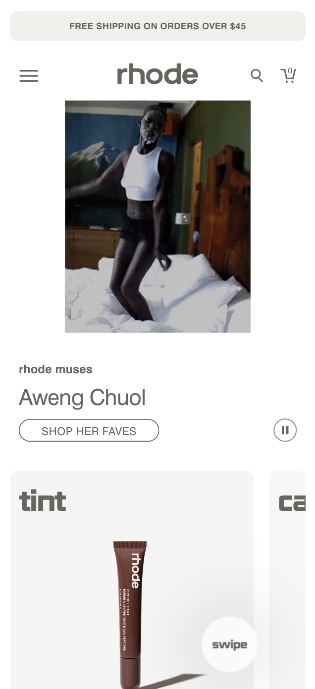
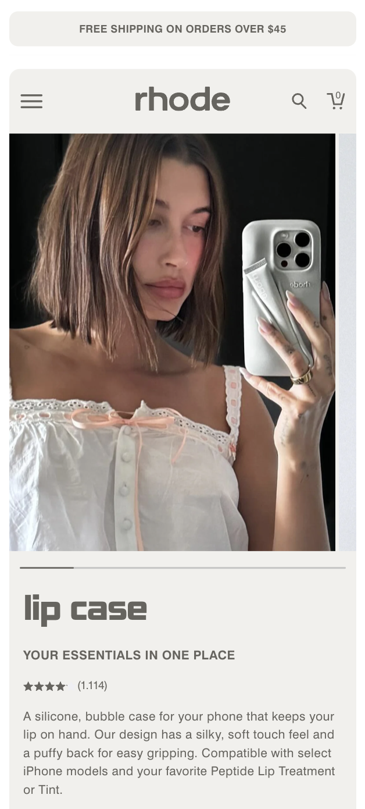
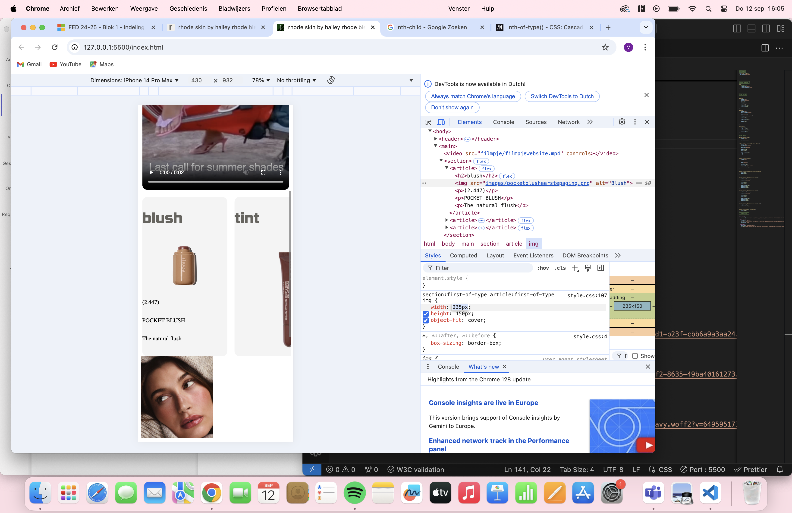
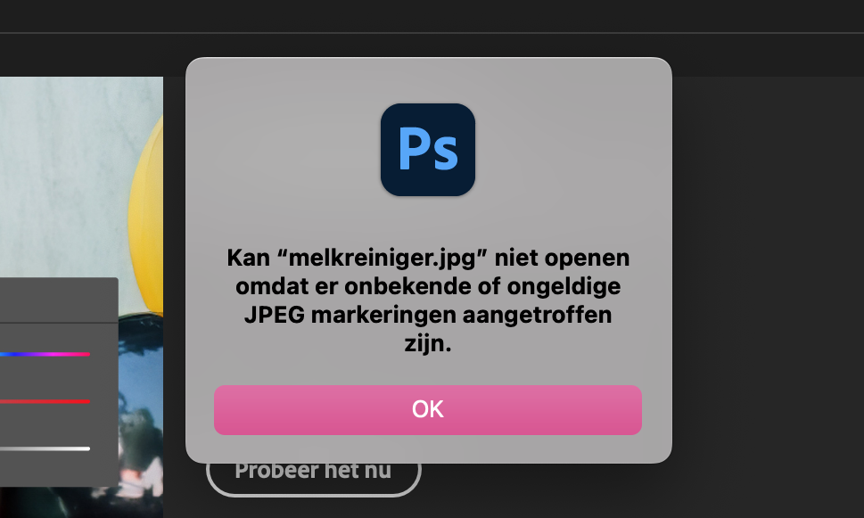
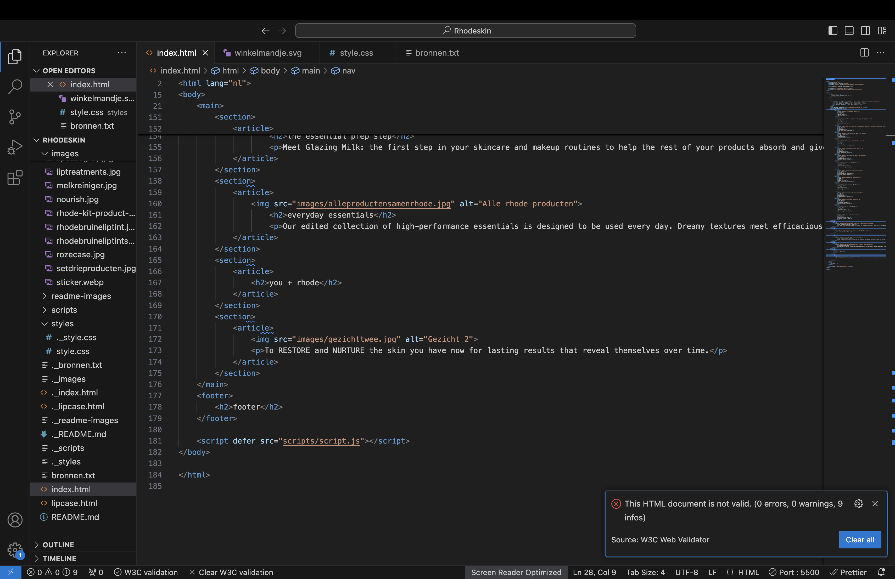
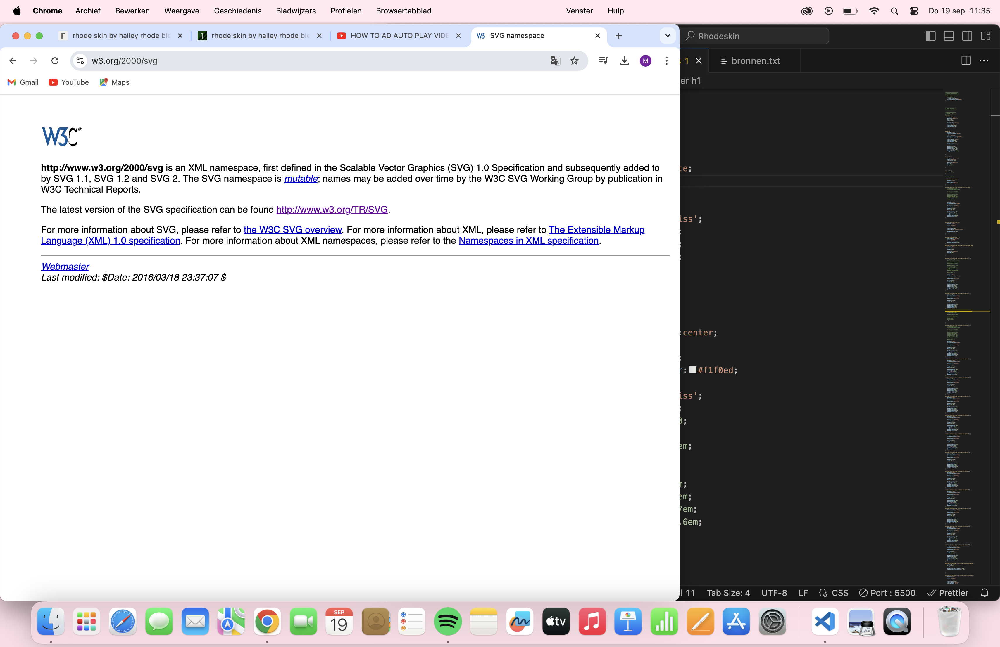
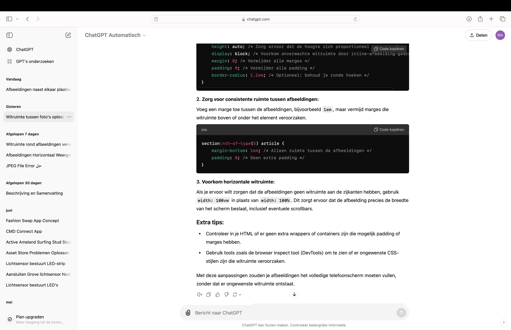

# Procesverslag
Markdown is een simpele manier om HTML te schrijven.  
Markdown cheat cheet: [Hulp bij het schrijven van Markdown](https://github.com/adam-p/markdown-here/wiki/Markdown-Cheatsheet).

Nb. De standaardstructuur en de spartaanse opmaak van de README.md zijn helemaal prima. Het gaat om de inhoud van je procesverslag. Besteedt de tijd voor pracht en praal aan je website.

Nb. Door *open* toe te voegen aan een *details* element kun je deze standaard open zetten. Fijn om dat steeds voor de relevante stuk(ken) te doen.

## Jij

  
uitwerken voor kick-off werkgroep

  ### Auteur:
  Maud Naastepad

  #### Je startniveau:
  Blauw/rood

  #### Je focus:
  Surface plane
 

## Je website

  
uitwerken voor kick-off werkgroep

  ### Je opdracht:
  Rhodeskin.com --> https://www.rhodeskin.com

  #### Screenshot(s) van de eerste pagina (small screen): 
  rhode skin by hailey rhode bieber
  

  #### Screenshot(s) van de tweede pagina (small screen):
  lip case | rhode skin
  
 

## Toegankelijkheidstest 1/2 (week 1)

  
uitwerken na test in 2e werkgroep

  ### Bevindingen
  Ik heb nooit eerder een screen reader gebruikt dus vond het sowieso erg zoeken met de knoppen. De reader gaf al snel aan dat ik dan op tab zou moeten klikken om elk kopje te kunnen horen. Het ging erg stroef, de tekst herhaalde zich steeds en er werd niet duidelijk verteld wat er op een afbeelding te zien was. Ook viel het tegen dat het hele lange onduidelijke zinnen waren en ik hierdoor met een beperking moeilijk begrijp wat er precies mee wordt bedoeld. Wel was de stem heel duidelijk en articuleerde goed. Ook werd er aangegeven wanneer ik bij een navigatie ben en wanneer het een button is. 

## Breakdownschets (week 1)

  
uitwerken na afloop 3e werkgroep

  ### de hele pagina: 
  

  ### dynamisch deel (bijv menu): 
  

  ### wellicht nog een dynamisch deel (bijv filter): 
  

## Voortgang 1 (week 2)

  
uitwerken voor 1e voortgang

  ### Stand van zaken

  ### Agenda voor meeting
  samen met je groepje opstellen

  | Lara           | Peter              | Mamush       | Ik               |
  | ---            | ---                | ---          | ---              |
  | Articles       | ---                | H1, H2, H3   | Scrollbar en img erin |
  | canvas elementen| ---               | Articles     | Uitleg css opstelling sections |
  | ...            | ...                | ...          | ...              |

  ### Verslag van meeting
  hier na afloop snel de uitkomsten van de meeting vastleggen

  - Een goede opbouw van html is eerst section en dan article, een section is een heel blok met alle content van de verschillende articles.
  - Als je meerdere sections wil gebruiken in css, moet je nth-of-type() gebruiken. Hierdoor wordt de organisatie van je css mooi.
  - Heel goed opletten met gebruiken van pixels! Gebruik hier bijvoorbeeld em, vw, of procenten voor.
  - Met flex-direction maak je een verticale of een horizontale rij om hier je content goed in te kunnen sorteren.
  - Leer omgaan met padding en margins en voorkom om vooraf width en heights te zetten.

## Voortgang 2 (week 3)

  
uitwerken voor 2e voortgang

  ### Stand van zaken
  Ik ben na de feedback van vorige week donderdag weer verder gegaan met de code. Ik heb veel geleerd van deze feedback en ook van de studenten erbij. Ik heb alle pixels in mijn code omgezet naar em door alles door 16 te delen. Ik liep even vast met het filmpje en de border-radius na het verzetten naar em hiervan, maar heb er met hulp van de studentassistent weer een goed beeld van kunnen maken. 

  Verder had ik problemen met de grote van de afbeeldingen in de eerste section:
  
  Het is nu veranderd naar de grootte van iedere afbeelding. Het probleem hierbij was wel weer dat de achtergrond kleur verwijderd moest worden en ik transform:scale() zou moeten gebruiken om de afbeeldingen op goede grootte te krijgen.

  Ik wilde dit voordat ik transform:scale() ging gebruiken handmatig afsnijden in Photoshop en kreeg toen deze melding. 
   Door hulp van de docent is dit gelukt om met transform te doen. Thuis heb ik in mdn verder opgezocht hoe je de scale kunt gebruiken. Nu heb ik meer verstand van de grootte van een article en dat je het niet per se een achtergrond kleur aan toe moet voegen, maar ook met transform:scale() een goede overeenkomst kunt maken.

  ### Agenda voor meeting
  samen met je groepje opstellen

  | Julian         | Wessel             | Bibi         | Ik               |
  | ---            | ---                | ---          | ---              |
  | dit bespreken  | en dit             | en ik dit    | en dan ik dat    |
  | en dat ook nog | dit als er tijd is | nog een punt | dit wil ik zeker |
  | ...            | ...                | ...          | ...              |

  ### Verslag van meeting
  hier na afloop snel de uitkomsten van de meeting vastleggen

  - Je kunt margin-right gebruiken om de tekst op te schuiven naar onder.
  - Met scroll-snap-align:center zet je 
  - Check soms even de validator
- ...

## Toegankelijkheidstest 2/2 (week 4)

  
uitwerken na test in 9e werkgroep

  ### Bevindingen
  Lijst met je bevindingen die in de test naar voren kwamen (geef ook aan wat er verbeterd is):

## Voortgang 3 (week 4)

  
uitwerken voor 3e voortgang

  ### Stand van zaken
   Ik heb weer heel veel gehad aan de feedback van vorige week donderdag. De studentassistenten hielpen me met vele goede vragen die ik nog had voor de laatste content dingen. Een daarvan was bijvoorbeeld hoe je de scrollbar in de eerste en de zesde section op het midden van ieder plaatje kon uit laten komen. Hiervoor was alleen de regel 'scroll-snap-align:center' nodig. 

   Ik heb ondertussen alle validators even gecheckt en alles was valid in html en css.
   
   Wel waren er veel info meldingen over de articles.

   Ik was erg verward met hoe je op een goede manier een svg in html moest zetten dus stelde die vraag. Ik kreeg al snel van de docent en assistenten een makkelijke uitleg. Eerst de html edit maken van de svg en dan in een mapje en html zetten. Nu moest ik alleen zelf de grootte en positite nog goed maken.
   
   Deze error kreeg ik als ik de svg net als img ging downloaden.
   
   Door de svg tip ben ik veel sneller gegaan in iconen neerzetten en dus ook een navigatiebar die ik met javascript compleet ga maken.

   Ik was bezig met de afbeeldingen goed te zetten van de zesde section en kreeg steeds dat de plaatjes of meters uit elkaar stonden, of onder elkaar gingen staan. Ik heb af en toe wat vragen gesteld aan chatGPT en bleek uiteindelijk te zijn dat ik niet width:100% moest maken van de afbeelding maar width:100vw. 
   

   <!-- meer problemen neerzetten -->

   Na deze problemen ging het verder erg goed! Ik ben een stuk verder met de content voor de tweede pagina en kwam erachter om veel css regels van pagina 1 korter te maken, dat ik meer regels zonder classes kan gebruiken voor de 2e pagina.

   Door steeds weer opnieuw te kijken naar je eerdere css regels is het veel makkelijker om weer de content erin te zetten.

   Na deze problemen en goede resultaten ging ik beginnen aan de surface plane:

   Surface plane:

  ### Agenda voor meeting
  samen met je groepje opstellen

  | student 1      | student 2          | student 3    | student 4        |
  | ---            | ---                | ---          | ---              |
  | dit bespreken  | en dit             | en ik dit    | en dan ik dat    |
  | en dat ook nog | dit als er tijd is | nog een punt | dit wil ik zeker |
  | ...            | ...                | ...          | ...              |

  ### Verslag van meeting
  hier na afloop snel de uitkomsten van de meeting vastleggen

  - punt 1
  - punt 2
  - nog een punt
  - ...

## Eindgesprek (week 5)

  
uitwerken voor eindgesprek

  ### Je uitkomst - karakteristiek screenshots:
  

  ### Dit ging goed/Heb ik geleerd: 
  Korte omschrijving met plaatjes

  

  ### Dit was lastig/Is niet gelukt:
  Korte omschrijving met plaatjes

  

## Bronnenlijst

  
continu bijhouden terwijl je werkt

  Nb. Wees specifiek ('css-tricks' als bron is bijv. niet specifiek genoeg). 
  Nb. ChatGpT en andere AI horen er ook bij.
  Nb. Vermeld de bronnen ook in je code.

  1. bron 1
  2. bron 2
  3. ...

